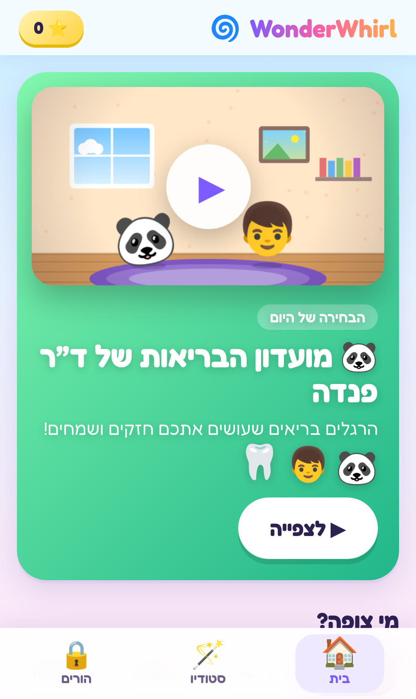
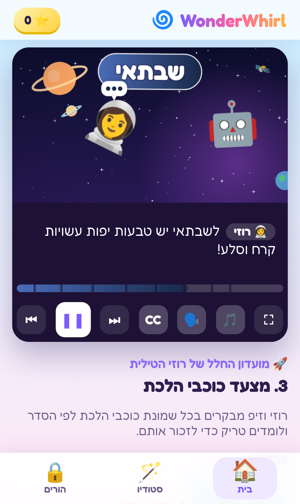
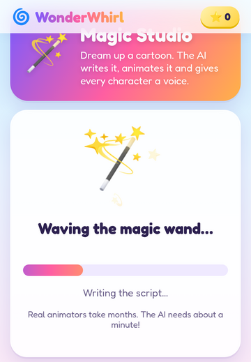
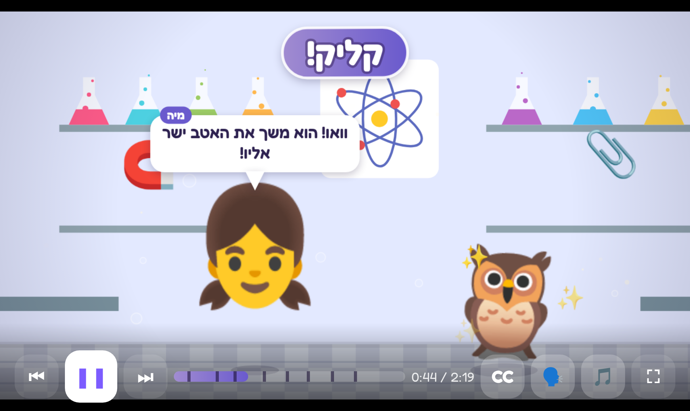

# WonderWhirl 🌀

**Animated mini-series for kids, written by AI.** Every world (animals, math, physics, kindness, feelings, space, nature, the body, world cultures, letters, inventions, art & music, coding and safety) has cartoon shows with recurring characters, narration and character voices, a theme song, subtitles and a short quiz after each episode. Parents can generate brand-new shows or new episodes on any topic, in 12 languages, with Claude.

It runs as an **iPhone app** (Capacitor + Xcode) and on the web. The app speaks **Hebrew by default** (right-to-left), with **English** and **French** a tap away in the parent zone. Every built-in show exists in all three languages.

<p>
  
  
  
</p>


## How the "videos" work

Claude writes each episode as a structured **script**: scenes, backgrounds, which characters are on stage and what they do (walk, fly, swim, think, cheer, and so on), props, big on-screen captions, every spoken line, a quiz and a takeaway. The app's animation engine plays that script like a video on a `<canvas>`:

- **20 painted, animated sets**: jungle with swaying vines, underwater with rising bubbles, space with a shooting star, a city with a working traffic light, a lab with bubbling flasks, a theater stage with spotlights, and more.
- **Characters are emoji puppets** with 16 performances, entrances, name tags, speech bubbles and squash-and-stretch.
- **Living sets:** butterflies, birds, ducks, crabs, fish, taxis, fireflies and shooting stars wander through the background; leaves, raindrops and snowflakes fall; characters land in a puff of dust.
- **A timeline clock** drives camera moves (including close-ups on whoever is talking), iris, star and stripe transitions, captions and narration. If a voice runs long, the clock waits for it while the characters keep moving, so words and pictures never drift apart. You can play, pause, skip scenes and scrub.
- **Natural AI voices.** With a Google Gemini key on the server, every line is performed by Gemini text-to-speech: a warm storyteller narrator, and a distinct voice and acting style per character (giggly, gentle, booming, wise, robot). Mouths move with the loudness of the words, and the episode re-times itself to the real recordings. Clips are rendered once and cached in `data/audio/`. Without a key, the device's own voices are used.
- **Each series gets its own theme song**, generated live with Web Audio (warm chords, an echoing melody, bass and drums). It ducks under the narration.
- **Subtitles adapt to the screen.** On a phone held upright, lines appear as large subtitles under the video. In landscape the video fills the screen and lines appear as speech bubbles inside it.

### Episode length

Episodes are bite-sized and grow with the child: **about 1–2 minutes for ages 3–5, 2–3 minutes for ages 6–8, and 3–4 minutes for ages 9–12.** Each series is a run of short episodes with autoplay, so kids can watch one or a few in a row. Every episode ends at a natural stopping point with a recap and a quiz, which suits young attention spans and healthy screen-time habits. There's an optional daily limit in the parent zone.

## What's in the box

- **14 built-in mini-series (42 episodes), in Hebrew, English and French** (126 episodes in all), one per world. The rhymes and alphabet show is written separately in each language (ארנב/זנב, א־ב־ג; chat/plat, A comme ananas). They work offline, with no AI key needed.
- **Magic Studio:** make a new 3-episode series about any topic or idea, or the next episode of any show (in English, Spanish, French, German, Hebrew, Arabic, Portuguese, Italian, Russian, Chinese, Hindi or Japanese).
- **Bulk generation** (`npm run seed`) to fill the library with many shows at half price using the Batches API.
- **Kid-safe by design:** strict writing rules, a second AI safety review of every script before it's published (it fails closed), blocked emoji, sanitized text, rate limits, and a parent gate.
- **Parent zone:** daily time limit with a friendly "time for a break" screen, voice speed, music, subtitles and autoplay settings, Studio lock, progress.
- **Quiz stars, watch history, continue watching, haptics on iPhone.**

## Quick start (web)

```bash
npm install
npm run dev          # API on :8787 + app on http://localhost:5173
```

Without API keys everything works except the Magic Studio, and the voices are the device's. To turn on the AI:

```bash
cp .env.example .env    # then fill in:
                        #   ANTHROPIC_API_KEY  Magic Studio (Claude writes new shows)
                        #   GEMINI_API_KEY     natural voices (https://aistudio.google.com/apikey)
npm run dev
```

To have every built-in episode voiced before anyone presses play (otherwise voices are made the first time each episode is watched):

```bash
npm run voices -- --language he       # or leave out --language for all three
```

## iPhone app

The iOS project lives in `ios/` (Capacitor 8, Swift Package Manager, no CocoaPods). You need a Mac with Xcode.

```bash
npm install
npm run ios          # builds the web app, syncs it into ios/, opens Xcode
```

In Xcode, pick an iPhone simulator and press **Run** (or run `npm run ios:run` to launch the simulator from the terminal). For a real iPhone, select your device and set your signing team under *Signing & Capabilities*.

**AI studio on iPhone.** The app never contains your API key; it talks to the WonderWhirl server.

- **Simulator:** run `npm run server` on the same Mac. The simulator reaches it at `http://localhost:8787` automatically.
- **Real device on your Wi-Fi:** `VITE_API_BASE=http://<your-mac-ip>:8787 npm run ios`
- **Production:** deploy the server (below) and build with `VITE_API_BASE=https://your-server.example.com`.

The iOS build plays sound even with the silent switch on (like other video apps), supports portrait and landscape, uses native voices and haptics, and ships with an app icon and launch screen (`resources/icon.svg` is the source).

## The AI

| Setting | Default | |
| --- | --- | --- |
| `CLAUDE_MODEL` | `claude-opus-5-5` | Writes scripts and reviews them |
| `CLAUDE_EFFORT` | `medium` | Thinking effort for writing (`low`…`max`). Reviews use `low` |
| `SAFETY_REVIEW` | `on` | Second-pass child-safety review of every script |
| `GENERATION_LIMIT_PER_HOUR` | `20` | Per-client limit on new shows/episodes |
| `GEMINI_API_KEY` | | Turns on natural voices (`GOOGLE_API_KEY` also works) |
| `GEMINI_TTS_MODEL` | `gemini-3.8-flash-tts` | Gemini text-to-speech model. Falls back to `gemini-2.5-flash-preview-tts` if your key can't use it |
| `AUDIO_DIR` | `data/audio` | Where rendered voice clips are cached |
| `VOICE_ENGINE` | `gemini` | `gemini` (AI Studio), `cloud` (Google Cloud Chirp 3 HD: 200 requests a minute) or `cloud-gemini` (Gemini voices with acting directions, through Google Cloud). Override per language with e.g. `VOICE_ENGINE_HE=cloud-gemini`. The Cloud engines need "Cloud Text-to-Speech API" enabled and `GOOGLE_TTS_API_KEY` |

- Scripts come back as **structured JSON** (`output_config.format`), validated with Zod and then repaired by `shared/normalize.ts`. That step clamps lengths, resolves character names, drops unknown or blocked emoji, and fixes quiz answers, so a slightly-off answer is repaired instead of failing.
- Live requests use **server-side refusal fallbacks** (`fallbacks: "default"`), so a request a safety classifier declines is retried on Anthropic's recommended fallback model instead of failing.
- What a child types in the Studio is passed to the model as story material inside `<viewer_idea>` tags, never as instructions. Markup characters are stripped.

### Filling the library in bulk

```bash
npm run seed -- --dry-run                                   # see the plan and a rough cost
npm run seed -- --categories animals,space --ages 3-5,6-8 --per 2
npm run seed -- --language es --per 1 --yes                 # Spanish shows for every world
npm run seed -- --language he,en,fr --yes                   # 378 episodes: different shows in each language
```

This writes every series with the Message Batches API (50% cheaper), runs the safety review as a second batch, and saves the shows that pass to `content/series/*.json`. Commit them to ship them with the server. A dry run shows about **$0.12 per 3-episode series**.

## Deploying the server

```bash
npm run build && npm start     # serves the web app and /api on $PORT (default 8787)
```

Shows made in the Studio are saved to `data/series/` (set `DATA_DIR` to change it). Behind a reverse proxy, set `TRUST_PROXY=1` so rate limits see real client IPs.

## Project layout

```
shared/        Episode-script types, Zod schemas, normalizer, timeline, categories
shared/builtin Built-in series, written in a small type-checked DSL
server/        Express API: catalog, Magic Studio jobs, Claude writer + safety reviewer, Gemini voices
shared/builtin/he, fr  Hebrew and French versions of the built-in shows
scripts/       seed.ts: bulk generation with the Batches API; voices.ts: pre-render voices
src/engine/    Canvas animation engine: backgrounds, motion, renderer, player, voices, music
src/           React app: pages, player UI, quiz, parent zone
ios/           Native iOS project (Capacitor)
tests/         Content validation, normalizer/timeline, API tests with a fake AI
```

## Tests

```bash
npm test            # 243 tests: every built-in script in every language, the normalizer, the timeline, the API, the voices
npm run typecheck
```
